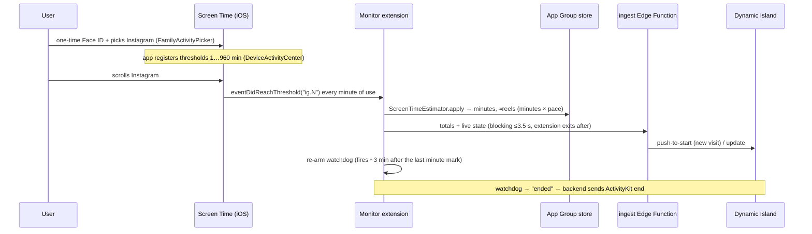
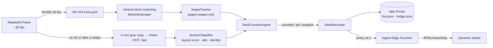

# Doomscore on iOS — how it works

iOS has no Accessibility-style API, no background services and no overlays. No app can read
another app's screen without a user-started screen broadcast. So each Android piece is
replaced by the closest thing Apple allows:

| Android (BrainPal) | iOS (Doomscore) |
|---|---|
| Accessibility Service reads IG view IDs, always on | **Auto mode: Screen Time API.** A DeviceActivity monitor extension is woken at every minute of Instagram/TikTok use → minutes × pace = estimated reels. Always on, no screen access |
| (same, exact per-reel) | **Precise mode (optional): Broadcast Upload Extension** (ReplayKit) sees the screen → on-device motion + text detection |
| UsageStats fallback counter | Auto mode is the iOS equivalent (Screen Time ≈ UsageStats) |
| Service notices IG opening | Screen Time's first minute mark, or the optional **Shortcuts automation** "When Instagram is opened" for an instant island |
| Floating bubble overlay | **Live Activity** in the Dynamic Island + Lock Screen, started/updated/ended by push |
| Glance widgets | **WidgetKit** home + lock screen widgets, Control Center button |
| Room DB + WorkManager sync | App Group JSON store + your own Supabase backend |

## 1. Auto mode (Screen Time, the default)

* **Authorization:** `AuthorizationCenter.requestAuthorization(for: .individual)` (Face ID,
  once). App picks are opaque `ApplicationToken`s — Doomscore never learns bundle IDs or
  anything about content.
* **Thresholds:** one `DeviceActivityEvent` per minute for the first 20 minutes, then every 2, 5,
  10 and 20 minutes up to 16 h (118 per app), on a daily 00:00–23:59 schedule, with
  `includesPastActivity: false`. Names are `ig.37` / `tt.12` (`ScreenTimeLadder`).
* **Estimator (`ScreenTimeEstimator`, unit-tested):** pure logic shared by app and extension.
  * Thresholds count from the moment monitoring was (re)registered on that day, from
    midnight on later days (`ScreenTimeRegistration` keeps the baseline).
  * iOS delivers thresholds late, twice, and sometimes all at once before they're possible.
    Duplicates are ignored; a threshold above the elapsed minutes is rejected as premature;
    growth is clamped to the wall clock. A burst of premature ones sets `needsRearmSince`,
    and the app re-registers on its next launch or background refresh.
  * Estimated reels accumulate at the pace in effect at the time, so recalibration never
    lowers today's number. Minutes that happen while precise mode is running are "covered"
    (counted exactly, not estimated).
  * Visits: a new session after 4 quiet minutes; the Shortcuts "opened" time is used as the
    start when available.
* **Pace:** onboarding quiz (5.0 / 3.5 / 1.5 reels per IG minute; TikTok 5.0). Each finished
  day with ≥ 8 covered minutes calibrates it: exact reels ÷ covered minutes, blended 60/40.
* **Memory:** DeviceActivityMonitor extensions are killed above **6 MB**. The extension links no
  SwiftUI/WidgetKit, saves the count before anything optional, and only decodes a state file
  holding today and yesterday; older days go to an append-only `screen-time-history.jsonl`.
  Server pings happen at visit start and then every ~2 minutes. A heartbeat in the App Group
  (Settings → advanced → Screen Time diagnostics) shows whether iOS is waking it at all.
* **Pace test:** no screen recording — the user scrolls ~20 reels, the app times the trip and
  stores the swipe speed; pace = swipe speed × the scroll-style share of Instagram time.
* **Watchdog:** each minute mark re-arms a one-off 15-minute schedule starting 3 minutes
  later. iOS calls `intervalDidStart` once the phone is in use, which ends the visit.
* **Limits:** Screen Time reports app minutes only — not reels, ads or rewatches — so auto
  mode is an estimate (marked ≈ everywhere). Distribution needs Apple's Family Controls
  entitlement (see APP_REVIEW.md).

## 2. Exact mode (Broadcast Upload Extension, opt-in only)

**Motion.** Each analysed frame becomes a 48×104 luma thumbnail (sparse 4×4 sampling,
~80k reads). Consecutive thumbnails are block-matched vertically (±60 % of the band,
status/tab bars excluded). A translation that explains ≥38 % of the frame difference is
motion; the swipe tracker accumulates it and, once content is still for 220 ms, emits a
**paged swipe** if the travel was 0.55–3.4 pages. Reels/Shorts/TikTok snap one page per
swipe; free-scrolling feeds and comment lists move arbitrary amounts or for too long and
are rejected (or later dropped by the classifier).

**Reading the overlay (Vision OCR, on-device).** After a swipe settles (300 ms) and at
~1 Hz while in a feed, a half-resolution grayscale copy goes through
`VNRecognizeTextRequest(.fast)`. Only the app's own overlay text is trusted: it's small
(`maxOverlayTextHeight`) and left-aligned (`overlayMaxMinX`). Subtitles and meme text
burned into videos are big or centred and change every second, so they're ignored. The
classifier scores the layout:

* vertical **action rail** of counters/labels on the right (`12.4K`, `Dislike`, `Share`),
* **caption block** bottom-left, `Follow`/`Subscribe`, the audio line (`♫ … Original audio`),
* feed headers (`Reels`, `For You`, `Spotlight`), automation hint (+1),
* negatives: `Your story`, `Liked by`, `Suggested for you`… (home feed).

It also extracts:

* **Ad**: `Sponsored` (+ 18 localisations) or left-aligned CTA buttons (`Shop now`,
  `Install`, `Learn more`…) → *skipped, like Android's "Sponsored Reel by"*.
* **Identity**: creator handle (text left of Follow/Subscribe, else the first username-like
  overlay line), first caption words, top like counter → rewatch detection (fuzzy match,
  tolerant to a +1 like).

**Counting rules (`ReelCounterEngine`, unit-tested):**

| situation | result |
|---|---|
| forward paged swipe → new identity | ✅ counted |
| reel with Sponsored / CTA | 🥷 ad skipped |
| swipe back | 🔁 rewatch |
| swipe forward onto a reel seen today | 🔁 rewatch |
| looping / auto-replay (no page change) | nothing |
| same reel after app switch / comments closed | nothing ("resume") |
| picture cut + 2 readings agree on a new reel, no swipe seen (dropped frames) | ✅ counted (implicit) |
| overlay text changes but the picture didn't cut (OCR misread) | nothing |
| swipe while comment sheet open | nothing |
| OCR unavailable | position model: count only beyond the furthest reel reached |
| "swipe" but same overlay after (camera pan, scrolling inside the video) | nothing |

**Budgets.** Broadcast extensions are capped at **50 MB**. The pipeline never retains
ReplayKit frames, reuses one gray buffer, runs one OCR at a time, and skips OCR when
`os_proc_available_memory()` < 14 MB. OCR ≈ 1/s at ~30–60 ms → a few % of one core.

**Privacy.** Frames and text exist only in memory for milliseconds. Nothing is logged,
saved or uploaded except per-day numbers. Reel identities used for "seen today" are
salted SHA-256 hashes, reset daily. *Strict privacy mode* only analyses while a Shortcuts
automation reports a reels app in front.

**Remote tuning.** Every threshold, zone and keyword lives in `DetectorConfig`; a partial
JSON at `DS_REMOTE_CONFIG_URL` is deep-merged and validated by the app, then hot-reloaded
by the extension — fix detection when Instagram changes its UI without an App Store release.

## 3. Live Activity ("the bubble")

* **Compact:** a cap ring with the mood emoji, and the live count (`~` when estimated).
  **Expanded:** Goob, a big gradient count, the cap meter, and three chips: a session timer
  (`Text(timerInterval:)` — iOS ticks it every second with no updates), reels this session,
  and the chill streak. **Lock Screen:** the same, plus an AUTO / LIVE / PAUSED pill.
* **Started** remotely by push-to-start when the Screen Time monitor sees a new visit, or
  locally by `ReelsAppOpenedIntent` (a `LiveActivityIntent` may start activities from the
  background) or when precise mode starts.
* **Updated** by push: app extensions can't update Live Activities, so the extensions report
  to the backend and `ingest` pushes ActivityKit updates (priority 10 at most every ~20 s,
  otherwise 5; `NSSupportsLiveActivitiesFrequentUpdates` is on). Auto-mode updates carry a
  4-minute stale date, so a quiet island shows "paused".
* **Ended** by the backend when the monitor's watchdog reports the visit is over (`ended`),
  by the "Reels App Closed" automation, or replaced when a new visit starts.
* `ContentState` decodes new fields with defaults, so the app and backend can update independently.
* Remote updates need a device token, which is issued when the user joins battles. Without
  it, the island still shows and refreshes whenever the app or intents run.

## 4. Data & sync

* App Group container: `screen-time.json` (auto mode: per-day minutes, estimates, visits,
  registrations), `screen-time-selections.json` (opaque app tokens), `live.json` (precise
  mode → everyone, heartbeat every 5 s so a crashed extension is detectable),
  `ledger.json` (exact per-day records), `foreground-hint.json`, `leaderboard-cache.json`,
  `seen-reels.json`, `diagnostics.json`. All reads/writes use `NSFileCoordinator` + atomic writes.
* What users see is `SharedStore.mergedLedger()`: exact records plus that day's Screen Time
  estimate (`DayRecord.estimatedReels`, `screenMinutes`).
* Cross-process pings: Darwin notifications (`screen-time-changed`, `live-changed`, …).
* Backend receives **absolute daily totals** (idempotent, the server keeps the highest) via
  a scoped device token. Every sender uploads the same merged numbers.

## 5. Extras

* **Streaks** — "chill streak": consecutive days at or under your daily cap (days with no
  scrolling count). Best streak tracked.
* **Wrapped** — week / month / year story recap: total, change vs previous period, time,
  meters of content scrolled (fun comparisons), doom hour, busiest weekday, wildest day,
  chill streak, ads dodged, scroll personality (8 archetypes), shareable 9:16 card.
* **Scroll Battle** — friends leaderboard (today / this week), "most cooked" or "touch
  grass" ranking, invite links, podium.

## 6. Known limits (be upfront with users)

* Auto mode estimates reels from minutes; only precise mode is exact.
* Screen Time callbacks are known to be late, doubled or premature on some iOS versions;
  the estimator guards against all three, but monitoring can still occasionally stop until
  the app is opened.
* Precise mode needs one tap per session and shows the red pill; iOS usually ends the
  broadcast when the phone locks. Detection needs on-device tuning per app version.
* `ReelsAppOpenedIntent` auto-opening precise mode needs iOS 26 (`DS_INTENT_MODES`) and the
  opt-in setting; iOS 18–25 get a notification nudge instead.
