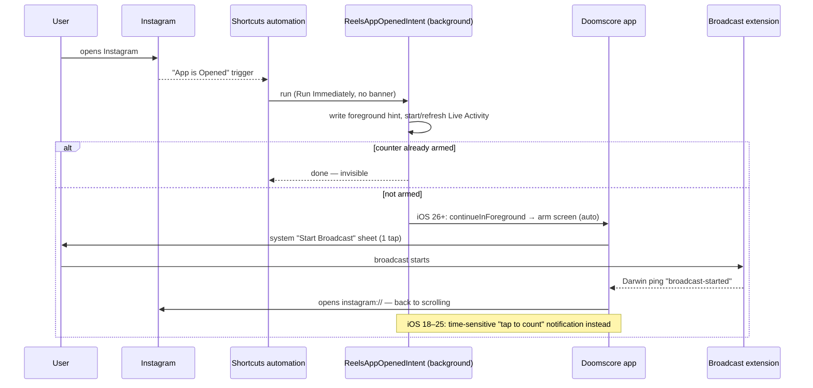
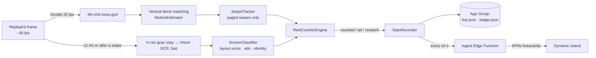

# Doomscore on iOS — how it works

iOS has no Accessibility-style API, no background services and no overlays, so each
Android piece is replaced by the closest thing Apple allows:

| Android (BrainPal) | iOS (Doomscore) |
|---|---|
| Accessibility Service reads IG view IDs | **Broadcast Upload Extension** (ReplayKit) sees the screen → on-device motion + text detection |
| Service notices IG opening | **Shortcuts personal automation** "When Instagram is opened → Run Immediately" runs our App Intent in the background |
| Floating bubble overlay | **Live Activity** in the Dynamic Island + Lock Screen, updated by push |
| Glance widgets | **WidgetKit** home + lock screen widgets, Control Center button |
| Room DB + WorkManager sync | App Group JSON store + your own Supabase backend |

## 1. Auto-start without opening the app

* **Setup is once**, ~30 s, guided in onboarding (`AutomationGuideView`). The first run
  auto-verifies (`automationVerifiedAt`).
* **What iOS will never allow:** starting the screen broadcast without one user tap.
  That's the floor: *zero* taps while armed, *one* tap per arm. The broadcast keeps
  running across apps until the user stops it or iOS ends it (usually on lock), so most
  sessions after the first need no taps at all.
* Other zero-open entry points: the Control Center control ("Count Reels"), and
  Control Center → long-press Screen Recording → Doomscore → Start Broadcast.
* Optional second automation "Is Closed → Reels App Closed" ends the Live Activity and
  tells the detector the app left (better accuracy + battery).

## 2. The detector (Broadcast Upload Extension)

**Motion.** Each analysed frame becomes a 48×104 luma thumbnail (sparse 4×4 sampling,
~80k reads). Consecutive thumbnails are block-matched vertically (±60 % of the band,
status/tab bars excluded). A translation that explains ≥38 % of the frame difference is
motion; the swipe tracker accumulates it and, once content is still for 220 ms, emits a
**paged swipe** if the travel was 0.55–3.4 pages. Reels/Shorts/TikTok snap one page per
swipe; free-scrolling feeds and comment lists move arbitrary amounts or for too long and
are rejected (or later dropped by the classifier).

**Reading the overlay (Vision OCR, on-device).** After a swipe settles (300 ms) and at
~1 Hz while in a feed, a half-resolution grayscale copy goes through
`VNRecognizeTextRequest(.fast)`. The classifier scores the layout:

* vertical **action rail** of counters/labels on the right (`12.4K`, `Dislike`, `Share`),
* **caption block** bottom-left, `Follow`/`Subscribe`,
* feed headers (`Reels`, `For You`, `Spotlight`), automation hint (+1),
* negatives: `Your story`, `Liked by`, `Suggested for you`… (home feed).

It also extracts:

* **Ad**: `Sponsored` (+ 18 localisations) or CTA buttons (`Shop now`, `Install`,
  `Learn more`…) → *skipped, like Android's "Sponsored Reel by"*.
* **Identity**: creator handle (text left of Follow/Subscribe), first caption words, top
  like counter → used for rewatch detection (fuzzy match, tolerant to a +1 like).

**Counting rules (`ReelCounterEngine`, unit-tested):**

| situation | result |
|---|---|
| forward paged swipe → new identity | ✅ counted |
| reel with Sponsored / CTA | 🥷 ad skipped |
| swipe back | 🔁 rewatch |
| swipe forward onto a reel seen today | 🔁 rewatch |
| looping / auto-replay (no page change) | nothing |
| same reel after app switch / comments closed | nothing ("resume") |
| identity changed without a detected swipe (auto-scroll, dropped frames) | ✅ counted (implicit) |
| swipe while comment sheet open | nothing |
| OCR unavailable | position model: count only beyond the furthest reel reached |
| "swipe" but same overlay after (camera pan) | nothing |

**Budgets.** Broadcast extensions are capped at **50 MB**. The pipeline never retains
ReplayKit frames, reuses one gray buffer, runs one OCR at a time, and skips OCR when
`os_proc_available_memory()` < 14 MB. OCR ≈ 1/s at ~30–60 ms → a few % of one core.

**Privacy.** Frames and text exist only in memory for milliseconds. Nothing is logged,
saved or uploaded except per-day numbers. Reel identities used for "seen today" are
salted SHA-256 hashes, reset daily. *Strict privacy mode* only analyses while a Shortcuts
automation reports a reels app in front.

**Remote tuning.** Every threshold, zone and keyword lives in `DetectorConfig`; a partial
JSON at `DS_REMOTE_CONFIG_URL` is deep-merged and validated by the app, then hot-reloaded
by the extension — fix detection when Instagram changes its UI without an App Store release.

## 3. Live Activity ("the bubble")

* Started locally by `ReelsAppOpenedIntent` (a `LiveActivityIntent` may start activities
  from the background) or when arming.
* **App extensions can't update Live Activities**, so the broadcast extension reports to
  your backend and the `ingest` function pushes ActivityKit updates (priority 10 at most
  every ~20 s, otherwise priority 5 to respect Apple's budget;
  `NSSupportsLiveActivitiesFrequentUpdates` is on).
* Push-to-start tokens let the backend start the activity when a session begins even if
  the app never ran (armed from Control Center).
* Without a backend it still shows, refreshed whenever the app or intents run.

## 4. Data & sync

* App Group container: `live.json` (extension → everyone, heartbeat every 5 s so a
  crashed extension is detectable), `ledger.json` (per-day records: total, per-app,
  hourly, watch time, ads, rewatches, sessions), `foreground-hint.json`,
  `leaderboard-cache.json`, `seen-reels.json`, `diagnostics.json`.
  All reads/writes use `NSFileCoordinator` + atomic writes.
* Cross-process pings: Darwin notifications (`live-changed`, `broadcast-started`, …).
* Backend receives **absolute daily totals** (idempotent) via a scoped device token.

## 5. Extras

* **Streaks** — "chill streak": consecutive days at or under your daily cap (days with no
  scrolling count). Best streak tracked.
* **Wrapped** — week / month / year story recap: total, change vs previous period, time,
  meters of content scrolled (fun comparisons), doom hour, busiest weekday, wildest day,
  chill streak, ads dodged, scroll personality (8 archetypes), shareable 9:16 card.
* **Scroll Battle** — friends leaderboard (today / this week), "most cooked" or "touch
  grass" ranking, invite links, podium.

## 6. Known limits (be upfront with users)

* One tap to arm; iOS usually ends the broadcast when the phone locks (red pill visible while on).
* OCR-based detection needs on-device tuning per app version — use Settings → Detector lab.
* `ReelsAppOpenedIntent` auto-opening needs iOS 26 (`DS_INTENT_MODES`); iOS 18–25 get a
  notification nudge instead.
* Screen Time API (FamilyControls) could add zero-tap *estimates* and blocking, but needs
  Apple's distribution entitlement — left as a phase-2 option.
